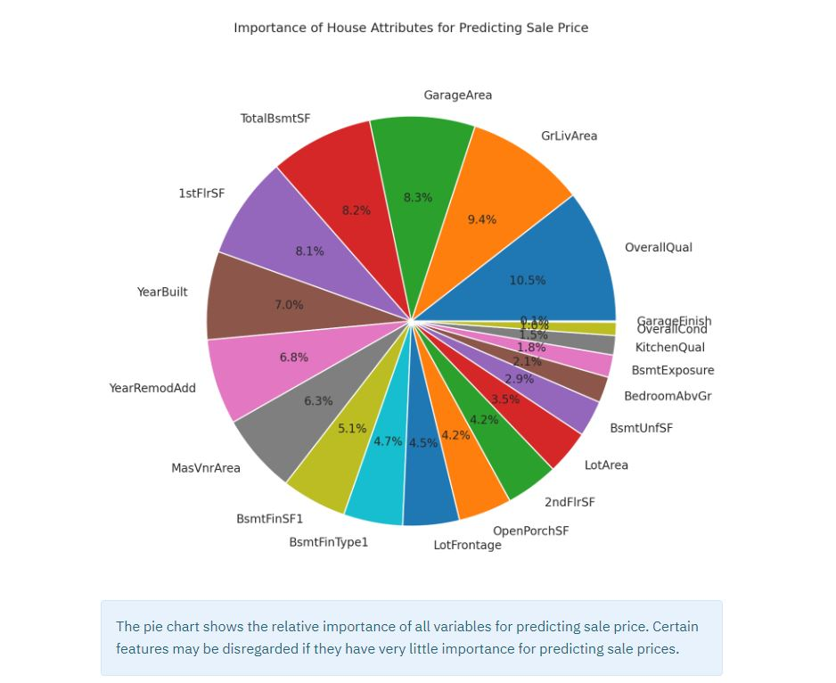

# Heritage Housing Issues
Data Correlation and Machine Learning Study 
Developed by [Helen Murugan](https://github.com/helenmurugan)

Live Site: [Heritage Housing Sale Price Predictor](https://housing-heritage-issues-559d8585752c.herokuapp.com/) 
Link to GitHub [Repository](https://github.com/helenmurugan/heritage-housing-issues)

## Contents
* [Introduction](#introduction)
* [CRISP-DM Workflow](#crisp-dm-workflow)
* [Datset Content](#dataset-content)
* [Business Requirements](#business-requirements)
* [Hypotheses and Validation](#hypothesis-and-validation)
* [Rationale to Map Business Requirements to the Data Visualizations and ML tasks](#rationale-to-map-business-requirements-to-the-data-visualizations-and-ml-tasks)
* [ML Business Case](#ml-business-case)
* [Dashboard Design](#dashboard-design)
    * [Page 1: Project Summary](#page-1-project-summary)
    * [Page 2: Sale Price Correlation Analysis](#page-2-sale-price-correlation-analysis)
    * [Page 3: Sale Price Prediction](#page-3-sale-price-prediction)
    * [Page 4: Hypothesis and Validation](#page-4-hypothesis-and-validation)
    * [Page 5: Machine Learning Model](#page-4-hypothesis-and-validation)
* [Testing](#testing)
    * [PEP8 Compliance Testing](#pep8-compliance-testing)
    * [Manual Testing](#manual-testing)
* [Unfixed Bugs](#unfixed-bugs)
* [Deployment](#deployment)
    * [Heroku](#heroku)
* [Main Technologies](#main-technologies)
* [Main Data Analysis and Machine Learning Libraries](#main-data-analysis-and-machine-learning-libraries)
* [Credits](#credits)
    * [Content](#content)
    * [Media](#media)
    * [Acknowledgements](#acknowledgements)

## Introduction
Heritage Housing Issues utilises conventional data analysis techniques and a machine learning model to answer a client's business requirements relating to property sales in Ames, Iowa, USA. It includes a comprehensive data correlation study aimed at visualising the relationship between house attributes and property sale price.  The project also features a machine learning model that enables the client and other users to predict property sale prices based on house attributes, through a dedicated web application. The project utilizes a Kaggle real estate dataset as its input. This dataset provides comprehensive data on house attributes and sale price in order to accurately answer a real-world business requirement. 

Heritage Housing Issues is the fifth and final portfolio project for a Code Institute Diploma in Full Stack Software Development with Predictive Analytics specialisation.

## CRISP-DM Workflow
The Cross Industry Standard Process for Data Mining (CRISP-DM) was followed during development:

* <b>EPIC 1 - Information gathering and data collection:</b> This stage involves understanding the business requirements (usually through extensive discussions with the client), identifying the data source(s), and collecting necessary data to support the project goals.

* <b>EPIC 2 - Data visualisation, cleaning, and preparation:</b> Correlation studies are performed to identify issues with the data that require dealing with. Data preparation tasks are performed to handle missing data, outliers, feature engineering transformations, and other preprocessing in preparation for modelling.

* <b>EPIC 3 - Modelling:</b> Different algorithms and methods are tried and their performance evaluated. The most suitable models are selected and fine tuned using different parameters to optimise performance based on business needs.

* <b>EPIC 4 - Model Evaluation:</b> Taking into account the business requirements and agreed performance metrics, the models are evaluated. Previous stages of CRISP-DM workflow may be reiterated (eg. data cleaning and feature engineering steps) to achieve best performance possible. The most suitable ML pipeline is selected for deployment.

* <b>EPIC 5 - Dashboard development and deployment:</b> Develop a web application using Streamlit, taking into account business requirements and principles for good user experience. The app is deployed through Heroku cloud hosting service.
 

These steps align neatly with the Agile development process, with the ability to move back and forth between stages/epics as new insights are gained and previous steps are refined. Ultimately, the project aims to deliver a product that satisfies the client's requirements.

## Dataset Content
* The dataset is sourced from [Kaggle](https://www.kaggle.com/codeinstitute/housing-prices-data).
* The dataset has 1460 rows and represents house records from Ames, Iowa, indicating house profile (Floor Area, Basement, Garage, Kitchen, Lot, Porch, Wood Deck, Year Built) and its respective sale price. The house attributes included in the raw dataset are listed in the table below.

|Variable|Meaning|Range|
|:----|:----|:----|
|1stFlrSF|First Floor square feet|334 - 4692|
|2ndFlrSF|Second-floor square feet|0 - 2065|
|BedroomAbvGr|Bedrooms above grade (does NOT include basement bedrooms)|0 - 8|
|BsmtExposure|Refers to walkout or garden level walls|Gd: Good Exposure; Av: Average Exposure; Mn: Minimum Exposure; No: No Exposure; None: No Basement|
|BsmtFinType1|Rating of basement finished area|GLQ: Good Living Quarters; ALQ: Average Living Quarters; BLQ: Below Average Living Quarters; Rec: Average Rec Room; LwQ: Low Quality; Unf: Unfinshed; None: No Basement|
|BsmtFinSF1|Type 1 finished square feet|0 - 5644|
|BsmtUnfSF|Unfinished square feet of basement area|0 - 2336|
|TotalBsmtSF|Total square feet of basement area|0 - 6110|
|GarageArea|Size of garage in square feet|0 - 1418|
|GarageFinish|Interior finish of the garage|Fin: Finished; RFn: Rough Finished; Unf: Unfinished; None: No Garage|
|GarageYrBlt|Year garage was built|1900 - 2010|
|GrLivArea|Above grade (ground) living area square feet|334 - 5642|
|KitchenQual|Kitchen quality|Ex: Excellent; Gd: Good; TA: Typical/Average; Fa: Fair; Po: Poor|
|LotArea| Lot size in square feet|1300 - 215245|
|LotFrontage| Linear feet of street connected to property|21 - 313|
|MasVnrArea|Masonry veneer area in square feet|0 - 1600|
|EnclosedPorch|Enclosed porch area in square feet|0 - 286|
|OpenPorchSF|Open porch area in square feet|0 - 547|
|OverallCond|Rates the overall condition of the house|10: Very Excellent; 9: Excellent; 8: Very Good; 7: Good; 6: Above Average; 5: Average; 4: Below Average; 3: Fair; 2: Poor; 1: Very Poor|
|OverallQual|Rates the overall material and finish of the house|10: Very Excellent; 9: Excellent; 8: Very Good; 7: Good; 6: Above Average; 5: Average; 4: Below Average; 3: Fair; 2: Poor; 1: Very Poor|
|WoodDeckSF|Wood deck area in square feet|0 - 736|
|YearBuilt|Original construction date|1872 - 2010|
|YearRemodAdd|Remodel date (same as construction date if no remodelling or additions)|1950 - 2010|
|SalePrice|Sale Price|34900 - 755000|

## Business Requirements
A client has received an inheritance from a deceased great-grandfather, included in the inheritance are four houses located in Ames, Iowa, USA. Although the client has an excellent understanding of property prices in her home country of Belgium, she fears that basing her estimates for property worth on her current knowledge of the Iowan market might lead to inaccurate appraisals. What makes a house desirable and valuable where she comes from might not be the same in Ames, Iowa. The client would like to maximise the sale prices for the four houses.

* 1 - The client is interested in discovering how the house attributes correlate with the sale price. Therefore, the client expects data visualisations of the correlated variables against the sale price to show that.
* 2 - The client is interested in predicting the house sale price from her four inherited houses and any other house in Ames, Iowa.

## Hypotheses and Validation
Taking into consideration the business requirements, knowledge of the dataset, and existing knowledge/assumptions on house sale prices in alternative locations, the following hypotheses have been formulated:

* <b>1: Property Size Hypothesis</b> 
    * <b>Null Hypothesis (H0):</b> Features relating to the size of a property are not correlated with sale price.
    * <b>Alternative Hypothesis (H1):</b> Features relating to the size of a property are positively correlated to sale price.
    * <b>How to Validate:</b> Investigate how features relating to property size in square feet or number of bedrooms are correlated to sale price. The features expected to correlate positively with sale price are '1stFlrSF', '2ndFlrSF', 'BedroomAbvGr', 'TotalBsmtSF', 'GarageArea' and 'GrLivArea'. Plot these features against SalePrice to determine the correlation. In addition, check the Spearman and Pearson correlation heatmaps to determine which features have the greatest effect on sale price.
    * <b>Validation:</b> Features related to property size are positively correlated to sale price as demonstrated by the heatmap analyses and data visualisations. '1stFlrSF', 'GarageArea','GrLivArea' and 'TotalBsmtSF' are strongly correlated with SalePrice, whilst '2ndFlrSF' and 'BedroomAbvGr' are weakly correlated to SalePrice.
    * <b>Action</b> Accept alternative hypothesis, sale price is positively and strongly correlated with the square footage of the first floor, garage, above grade living area and basement. However, the client should be informed that number of bedrooms and square footage of the second floor are only weakly positively correlated to sale price.

* <b>2: Year Built Hypothesis</b> 
    * <b>Null Hypothesis (H0):</b> The year of build does not have a positive correlation with sale price.
    * <b>Alternative Hypothesis (H1):</b> The year of build has a positive correlation with sale price.
    * <b>How to Validate:</b> Check Spearman and Pearson correlation heatmaps to assess correlation levels. Analyse plot of 'YearBlt' attribute vs. 'SalePrice'.
    * <b>Validation:</b> The Spearman and Pearson correlation heatmaps showed that 'YearBlt' has a moderate positive correlation to sale price. This is further demonstrated by a scatter plot.
    * <b>Action</b> Accept alternative hypothesis.

* <b>3: Lot Size Hypothesis</b> 
    * <b>Null Hypothesis (H0):</b> The lot size of a property does not have a strong positive correlation with sale price.
    * <b>Alternative Hypothesis (H1):</b> The lot size of a property has a strong positive correlation with sale price.
    * <b>How to Validate:</b> Check Spearman and Pearson correlation heatmaps to assess correlation levels for 'LotFrontage' and 'LotArea'.
    * <b>Validation:</b> 'LotFrontage' and 'LotArea' have a weak to moderate correlation with sale price.
    * <b>Action</b> Accept null hypothesis. This may be an interesting insight to the client, as it challenges preconceptions about which features affect sale price.

* <b>4: Sale Price Prediction Hypothesis</b> 
    * <b>Null Hypothesis (H0):</b> We are not able to predict a sale price with an R2 value of at least 0.75 based on important features that have been identified through machine learning.
    * <b>Alternative Hypothesis (H1):</b> We are able to predict a sale price with an R2 value of at least 0.75, based on important features that have been identified through machine learning modelling.
    * <b>How to Validate: Calculate and optimise R2 scores for train and test set during Modelling and Evaluation stages. Compare to agreed limit of 0.75.</b>
    * <b>Validation: R2 scores of 0.943 and 0.825 for the train set and test set respectively have been achieved.</b>
    * <b>Action</b> Accept alternative hypothesis.

## Rationale to Map Business Requirements to the Data Visualisations and ML tasks
<b>Business Requirement 1: Data Visualisation and Correlation Study</b>

* As a client, I want to perform an in-depth study of house records data in Ames, Iowa, in order to discover how the house attributes correlate to the sale price.
* As a client, I want to perform a correlation study using both Pearson and Spearman methods, in order to gain deeper insights into the multicollinearity relationships between variables and sale prices.
* As a client, I want to visualise the main variables plotted against sale price, in order to gain deeper insights on how house attributes correlate to sale price.
* As a client, I want to visualise house record data in a variety of ways such as heatmaps, scatterplots, bar plots, pie charts etc, in order to maximise my understanding of the complexities of the house sales market in the area.
* As a client, I want the results of this data study to feed directly into the development of a machine learning model, in order to predict house sale prices in Ames, Iowa.
* As a client, I want the findings of the correlation study to be communicated through a dedicated web application, in order to access and understand findings in a simple and user-friendly way.

<b>Business Requirement 2: Sale Price Prediction</b>

* As a client, I want to create a machine learning model that can accurately predict property sale prices based on house attributes, in order to maximise the sale price of my four inherited houses.
* As a client, I want to identify the most important house features to train an ML model on, in order to achieve the most accurate predictions.
* As a client, I want the ML model inputs to be house attributes and the output to be predicted sale price, in order to easily predict sale prices for my four inherited houses.
* As a client, I want a regressor model to be utilised to predict sale price with an R2 score of at least 0.75 on the train set as well as the test set, in order to measure and evaluate the performance of the model.
* As a client, I want the model to be optimimised based on testing a selection of algorithms and hyperparameters, in order to achieve the most accurate results for sale price predictions.
* As a client, I want to input only the most important features relating to house attributes into a dashboard in a web application, in order to quickly and accurately receive a sale price prediction from the ML model.

## ML Business Case
* Our client is an individual with inherited properties in Ames, Iowa, who seeks to gain insights into the factors influencing house sale prices in the area. Additionally, the client wishes to predict the sale prices of their inherited properties and explore the potential sale prices of other houses in Ames, Iowa.

* Our ideal outcome is to develop a predictive ML model that accurately estimates house sale prices based on various house attributes. The model will enable the client to make informed decisions regarding pricing strategies for their inherited properties and provide insights into the local real estate market in Ames, Iowa.

* The model will use supervised learning techniques, where the label or target is a continuous numeric variable - 'SalePrice' in US dollars. In this case, a linear regression model is appropriate to use. 

* The training data for the development of the ML model is a public dataset sourced from Kaggle. The dataset includes information on 24 house attributes, which are the variables for the ML modelling task (columns) and 1460 observations (rows). The training data will be refined through data pre-processing including data cleaning, exploratory data analysis and feature engineering. 

* Data cleaning will be required to remove missing data and will include techniques such as dropping variables, MeanMedianImputation and CategoricalImputation. 

* The aim of the Feature Engineering stage is to to provide quality data that a model can be trained on, by attempting to transform the data towards normal distribution, where possible. Techniques for feature engineering include Numerical Encoding, Categorical Encoding and SmartCorrelatedSelection where certain variables can be dropped if they have strong correlation to another variable. Additionally, techniques to handle outliers in the data will be explored, for example, using the Winsorizer method.

* We will apply established heuristics to select appropriate machine learning algorithms and tune hyperparameters to optimise model performance. Grid search cross validation of known regressor models will be utilised to identify the algorithm that generalises best on unseen data, measured by R2 scores. Hyperparameter optimisation will be used to tune the model(s) to allow for the best possible performance. These heuristics will ensure that our model is built on sound principles and leverages industry best practices to achieve accurate predictions of house sale prices.

* CRISP-DM workflow will be followed during development to maximise model performance and structure the development process. For example, data cleaning, feature engineering and feature selection can be revisited iteratively until we are satisfied with the model performance, taking into account the expectations agreed with the client.

* Our success metric, as agreed with the client, is to achieve R2 scores of at least 0.75 for both train and test sets. Additionally, since this is a prediction model, we would aim for the difference between R2train and R2test to be less than 0.15 to ensure that our model generalises well on unseen data and does not significantly overfit or underfit the data.

## Dashboard Design
The project will be built using a Streamlit dashboard and will contain the following pages:

### Page 1: Project Summary
* Statement of the project purpose.
* Project terms and jargon.
* Brief description of the dataset.
* Statement of business requirements.
* Links to further information.

Project Summary Page Screenshots

### Page 2: Sale Price Correlation Analysis
This page will satisfy the first business requirement of discovering how the house attributes correlate with the sale price. It includes checkboxes so the client has the ability to display the following visualisations of the data features:

* A sample of data from the dataset.
* Pearson and Spearman correlation heatmaps.
* Bar charts showing the most important features for both Pearson and Spearman correlation studies.
* Pie charts showing the relative importance of all features for both Pearson and Spearman correlation studies.
* Predictive Power Score analysis heatmaps showing multicollinearity between features.
* Scatter plots of the most important features vs. sale price.

Sale Price Correlation Analysis Page Screenshots

### Page 3: Sale Price Prediction
This page will satisfy the second business requirement of predicting house sale prices. It will include:

* Dat input widgets for property attributes.
* Display of the predicted sale price.
* Feature to predict the sale prices of the client's inherited house data, as well as the total value of all four properties.

Sale Price Predictor Page Screenshots

### Page 4: Hypothesis and Validation

* List of project hypotheses.
* Description of how project hypotheses were validated.
* Actions following hypothesis validation.

Project Hypothesis and Validation Page Screenshots

### Page 5: Machine Learning Model

* Description of the ML pipeline used to train the model.
* Information on feature importance.
* Evaluation of the pipeline performance.

ML Performance Page Screenshots

## Testing
### PEP8 Compliance Testing 
The python code from all .py files was passed through the [CI Python Linter](https://pep8ci.herokuapp.com/). Code passed with no errors in most cases. However, there was one exception where the code could not be split across multiple lines whilst maintaining readability.
* In page_sale_price_analysis - line 286:
    * pps_score_stats = pps_matrix_raw.query("ppscore < 1").filter(['ppscore']).describe().T

### Manual Testing
The deployed app has been thoroughly tested to ensure data visualisations are properly displayed and sale price predictions run correctly.

## Unfixed Bugs
There are no known bugs.

## Deployment
### Heroku
Live Site: [Heritage Housing Sale Price Predictor](https://housing-heritage-issues-559d8585752c.herokuapp.com/) 

1. Before deployment to Heroku, check that the project contains the following files and information.
    * setup.sh file containing streamlit configuration requirements.
    * Procfile containing 'web: sh setup.sh && streamlit run app.py'
    * runtime.txt file which sets the Python environment to 3.8.17, which will reduce any environment conflicts from development to production.
2. Log into the Heroku command line interface through the Gitpod terminal to set the stack to Heroku-20 and avoid 'unsupported version of Python' errors during deployment.
    * Install heroku with this command: 'curl https://cli-assets.heroku.com/install.sh | sh'
    * Log in to Heroku using your Heroku API as the password.
    * Use command to set tech stack: 'heroku stack:set heroku-20'
3. Log in to the Heroku website and create a new app
    * At the Deploy tab, select GitHub as the deployment method.
    * Select your GitHub repository name and click Search. When it locates the correct repo, click Connect.
    * Select Main branch, then Deploy Branch.
    * Watch the build log for any errors during deployment. Once successfully built, click to Open App.

## Main Technologies
* <b>GitHub</b> - a web-based platform and version control system that was utilised for hosting and managing the project repository.
* <b>Gitpod</b> - a cloud-based integrated development environment used to create this project.
* <b>Jupyter Notebooks</b> - interactive computing environments that allow users to create and share documents containing code, visualisations and text. Jupyter Notebooks were used throughout this project for data analysis, and ML pipeline development and evaluation.
* <b>Kaggle</b> - an online platform with open source data, used as the data source for this project.

## Main Data Analysis and Machine Learning Libraries
* <b>numpy</b> - a library that provides support for large, multi-dimensional arrays and matrices, along with a collection of mathematical functions to operate on these arrays efficiently. Numpy was used throughout, for example in the Data Cleaning Notebooks to create arrays and masks for filtering data.
* <b>pandas</b> - a library with easy-to-use data structures and functions. Throughout this project, pandas was utilised for working with dataframes, selecting and displaying key features of the data, creating reports and providing insights on data.
* <b>matplotlib</b> - a library for creating static and interactive visualisations in Python. Matplotlib was used in the Data Visualisations and Feature Engineering Notebooks for displaying plots eg. scatterplots, bar plots, pie charts and heatmaps.
* <b>seaborn</b> - a library used for visualising data from pandas dataframes and arrays. Seaborn was utilised in the Feature Engineering Notebook to plot heatmaps for correlation and predictive power score analysis.
* <b>ydata_profiling</b> - a package for data profiling, that automates and standardises the generation of detailed reports, complete with statistics and visualisations. In Data Cleaning and Feature Engineering Notebooks it was utilised to generate pandas profile reports with tremendous insights on the data.
* <b>feature_engine</b> - a library that provides a set of tools for feature engineering. It was used in the Feature Engineering Notebook for data transformation such as SmartCorrelatedSelection, OrdinalEncoder and Winsorizer.
* <b>ppscore</b> - predictive power score is a statistical metric used to quantify the predictive power of one feature with respect to another feature in a dataset. This tool was utilised in the Data Cleaning Notebooks to assess correlation levels between house attributes.
* <b>streamlit</b> - a library used for creating interactive web applications for data science and machine learning projects. Streamlit was utilised for creating the user dashboard.
* <b>scikit-learn</b> - a library that provides a range algorithms for machine learning models. Scikit-learn was utilised in the Modelling and Evaluation Notebooks for grid search cross validation and hyperparameter optimisation.
* <b>xgboost</b> - eXtreme Gradient Boosting is a library that provides gradient boosting algorithms for machine learning tasks. Xgboost was utilised in the Modelling and Evaluation Notebooks for for grid search cross validation.

## Credits 

### Content
* The following documentation and websites were referenced during hyperparameter tuning in the Modelling and Evaluation Notebooks.
    * [GradientBoostingRegressor documentation](https://scikit-learn.org/stable/modules/generated/sklearn.ensemble.GradientBoostingRegressor.html)
    * [RandomForestRegressor documentation](https://scikit-learn.org/stable/modules/generated/sklearn.ensemble.RandomForestRegressor.html#sklearn-ensemble-randomforestregressor)
    * [ExtraTreesRegressor documentation](https://scikit-learn.org/stable/modules/generated/sklearn.ensemble.ExtraTreesRegressor.html)
    * [Hyperparameter Tuning the Random Forest in Python](https://towardsdatascience.com/hyperparameter-tuning-the-random-forest-in-python-using-scikit-learn-28d2aa77dd74)
    * [How Extra trees classification and regression algorithm works](https://pro.arcgis.com/en/pro-app/latest/tool-reference/geoai/how-extra-tree-classification-and-regression-works.htm#:~:text=The%20extra%20trees%20algorithm%2C%20like,selected%20randomly%20for%20each%20tree.)
    * [Ensembles: Gradient boosting, random forests, bagging, voting, stacking](https://scikit-learn.org/stable/modules/ensemble.html#forest)
* The following documentation was used when developing the streamlit app.
    * [Streamlit documentation](https://docs.streamlit.io/)

### Code
* Code Institute custom code was used for data cleaning, feature engineering and model fitting and is referenced in the notebooks.
* The following projects were used for inspiration during the development of this app.
    * [Heritage Housing Issues project by URiem](https://github.com/URiem/heritage-housing-PP5/blob/main/README.md)
    * [Heritage Housing Issues project by t-ullis](https://github.com/t-hullis/milestone-project-heritage-housing-issues)

## Acknowledgements

* Code Institute peers and staff, in particular the Slack community on the #project-portfolio-5-predictive-analytics channel who were always there to support each other.
* Precious Ijege for his expert mentoring.
* My husband, Arul Murugan, for supporting me during the highs and lows of software development.

